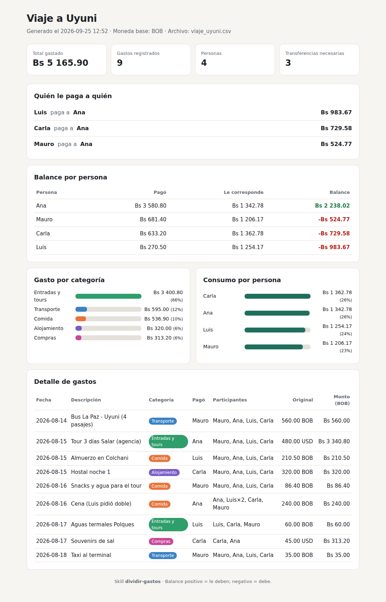
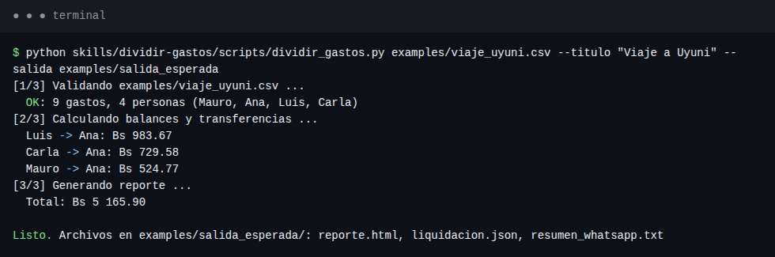
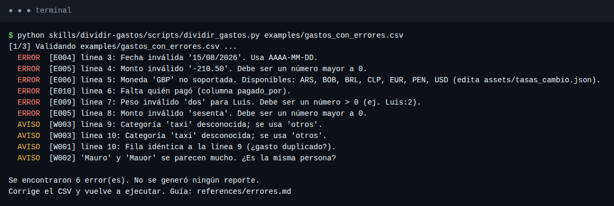
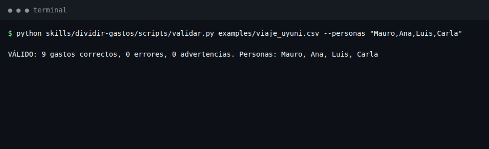
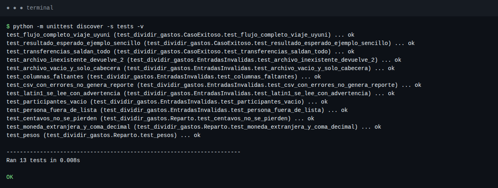

# Skill `dividir-gastos`

**Autor:** Mauro Alejandro Cuba Roman · Tarea 1 – Creación de una skill propia

Skill para agentes de IA (Claude Code / Codex) que convierte una lista de **gastos compartidos** (viaje, salida, depa compartido) en una liquidación clara: **quién le paga a quién y cuánto**, con el menor número de transferencias. Valida el CSV, convierte monedas (BOB, USD, …), reparte al centavo exacto y genera un **reporte HTML** y un **resumen para WhatsApp**.



---

## ¿Cuándo se usa?

Cuando el usuario dice cosas como *"dividamos la cuenta del viaje"*, *"¿quién le debe a quién?"*, *"saca las cuentas de la cena"* o entrega una lista de gastos con quién pagó. La descripción completa para el agente está en [`skills/dividir-gastos/SKILL.md`](skills/dividir-gastos/SKILL.md).

## Estructura

```
tarea1_skill/
├── skills/dividir-gastos/          ← LA SKILL (esto es lo que se instala)
│   ├── SKILL.md                    instrucciones y descripción para el agente
│   ├── scripts/
│   │   ├── dividir_gastos.py       flujo completo: validar → liquidar → reporte
│   │   ├── validar.py              paso 1: valida el CSV (errores E### / avisos W###)
│   │   ├── liquidar.py             paso 2: reparte en centavos y calcula transferencias
│   │   ├── reporte.py              paso 3: HTML + resumen WhatsApp desde el JSON
│   │   └── comun.py                utilidades compartidas
│   ├── assets/
│   │   ├── tasas_cambio.json       moneda base y tasas (usado por validar.py)
│   │   ├── categorias.json         categorías válidas y colores (validar.py, reporte.py)
│   │   ├── plantilla_reporte.html  plantilla del reporte (reporte.py)
│   │   ├── plantilla_resumen.txt   plantilla del mensaje WhatsApp (reporte.py)
│   │   └── plantilla_csv.csv       CSV de ejemplo para el usuario
│   └── references/
│       ├── formato_csv.md          especificación del CSV
│       ├── errores.md              catálogo de errores y cómo corregirlos
│       └── algoritmo.md            cómo se calcula y por qué (decisiones)
├── examples/                       entradas de ejemplo + salida_esperada/
├── tests/test_dividir_gastos.py    13 pruebas (unittest)
├── docs/capturas/                  capturas de la demostración
├── install.sh / install.ps1        instaladores
└── README.md
```

## Requisitos

- **Python 3.8 o superior.** Nada más: solo usa la biblioteca estándar (no hay `pip install`).
- Opcional: Claude Code o Codex para usarla como skill desde el agente.

## Instalación

```bash
git clone https://github.com/maurocuba/tarea1_skill.git
cd tarea1_skill

# Como skill de Claude Code (~/.claude/skills) — por defecto
./install.sh            # o: ./install.sh codex | proyecto | todos

# Windows (PowerShell)
.\install.ps1           # o: .\install.ps1 -Destino codex
```

También se puede usar **sin instalar**, llamando directamente a los scripts (ver abajo).

## Uso

### Desde el agente

Con la skill instalada, basta pedirle al agente algo como:

> "Divide los gastos del viaje que están en `examples/viaje_uyuni.csv` y dime quién le debe a quién."

El agente sigue el flujo de `SKILL.md`: valida, si hay errores te pregunta el dato correcto (no inventa), ejecuta el script y te entrega el reporte.

### Desde la terminal

```bash
python skills/dividir-gastos/scripts/dividir_gastos.py examples/viaje_uyuni.csv \
       --titulo "Viaje a Uyuni" --salida salida_gastos
```

| Opción | Descripción |
|---|---|
| `--titulo` | Título del reporte |
| `--salida` | Carpeta de salida (por defecto `salida_gastos/`) |
| `--personas "Ana,Luis"` | Lista cerrada de personas: cualquier otro nombre es error (detecta typos) |
| `--tasas archivo.json` | Tasas de cambio alternativas |

Scripts por paso: `validar.py archivo.csv [--json]`, `liquidar.py archivo.csv -o liq.json`, `reporte.py liq.json --titulo X`.

**Códigos de salida:** `0` OK · `1` CSV con errores (no se genera nada) · `2` archivo no encontrado.

## Ejemplo de entrada y resultado esperado

**Entrada** — [`examples/cena_sencilla.csv`](examples/cena_sencilla.csv) (separado por `;`, coma decimal, como lo exporta Excel en español):

```csv
fecha;descripcion;monto;moneda;pagado_por;participantes;categoria
2026-09-20;Pizza viernes;185,50;BOB;Sofía;todos;comida
2026-09-20;Gaseosas;42;BOB;Diego;todos;comida
2026-09-20;Helado;30;BOB;Valeria;Valeria|Diego;comida
```

**Resultado esperado:**

```
[1/3] Validando examples/cena_sencilla.csv ...
  OK: 3 gastos, 3 personas (Sofía, Diego, Valeria)
[2/3] Calculando balances y transferencias ...
  Valeria -> Sofía: Bs 60.83
  Diego -> Sofía: Bs 48.84
[3/3] Generando reporte ...
  Total: Bs 257.50
```

Comprobación manual: la pizza (185.50) se divide entre 3 = 61.83 / 61.83 / 61.84 (el centavo sobrante se asigna, no se pierde); gaseosas 14 c/u; helado 15 c/u entre Valeria y Diego. Sofía consumió 75.83 y pagó 185.50 → le deben 109.67 = 60.83 + 48.84. ✔

Ejemplo más completo (4 personas, BOB + USD, pesos `Luis:2`, participantes parciales): [`examples/viaje_uyuni.csv`](examples/viaje_uyuni.csv) → salida en [`examples/salida_esperada/`](examples/salida_esperada/) (`reporte.html`, `liquidacion.json`, `resumen_whatsapp.txt`).

Formato del CSV: [`references/formato_csv.md`](skills/dividir-gastos/references/formato_csv.md). Participantes: `todos`, `Ana|Luis` o con pesos `Ana|Luis:2`.

## Pruebas

```bash
python -m unittest discover -s tests -v
```

13 pruebas: caso exitoso de punta a punta, resultado exacto esperado, reparto al centavo, pesos, monedas, y entradas inválidas (archivo inexistente, vacío, columnas faltantes, fecha/monto/moneda/peso inválidos, persona fuera de lista, archivo Latin-1).

## Demostración (capturas)

**1. Caso exitoso** — flujo completo en terminal:



**2. Reporte HTML generado** — ver imagen al inicio; también se adapta a celular y modo oscuro: [`06_reporte_movil_oscuro.png`](docs/capturas/06_reporte_movil_oscuro.png)

**3. Entrada inválida** — [`examples/gastos_con_errores.csv`](examples/gastos_con_errores.csv): se reportan **todos** los errores con su línea y **no** se genera reporte:



**4. Validación con lista cerrada de personas:**



**5. Pruebas automáticas:**



## Manejo de errores (resumen)

| Problema habitual | Qué hace la skill |
|---|---|
| Fecha `15/08/2026` | `E004` con la línea y el formato correcto |
| Monto negativo o en texto | `E005` |
| Moneda no configurada (`GBP`) | `E006` y lista de monedas disponibles |
| Nombre mal escrito (`Mauor`) | `W002` aviso de nombres parecidos, o `E007` con `--personas` |
| Gasto registrado dos veces | `W001` fila duplicada |
| CSV de Excel en Latin-1 / con `;` | Se lee igual (`W004`) / se detecta el separador |
| Faltan columnas | `E003` indicando cuáles |

Catálogo completo: [`references/errores.md`](skills/dividir-gastos/references/errores.md).

## Decisiones principales

1. **Centavos enteros** en todos los cálculos → la suma de balances es exactamente 0 (sin errores de punto flotante).
2. **Método del resto mayor** para repartir centavos sobrantes de forma justa y determinista.
3. **Transferencias greedy** (mayor deudor → mayor acreedor): como máximo `n − 1` transferencias. El óptimo exacto es NP-difícil; se documenta la limitación.
4. **Validar todo antes de calcular** y reportar todos los errores juntos: un dato malo nunca produce un reparto incorrecto en silencio.
5. **Configuración en `assets/`** (tasas, categorías, plantillas): se cambia sin tocar código.
6. **Sin dependencias** y HTML autocontenido: funciona sin internet y en cualquier PC con Python.

Detalle en [`references/algoritmo.md`](skills/dividir-gastos/references/algoritmo.md).
